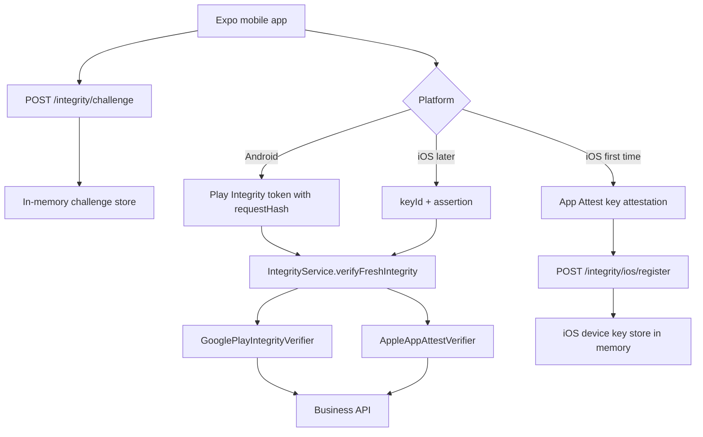

# Mobile App Integrity Demo

This repo shows a minimal but realistic integrity architecture with:

- `/mobile`: Expo React Native client targeting Expo SDK 55
- `/backend`: Java 17 + Spring Boot 3.4.4 backend
- Android flow: Google Play Integrity style verification
- iOS flow: Apple App Attest style registration + assertion verification
- A shared backend integrity abstraction so business endpoints do not need to know platform details

The implementation is intentionally mock-first so it can run on simulator/emulator. The real-mode classes are included as placeholders with explicit TODOs for wiring Google and Apple verification later.

## Architecture



## Comparison Table

| Platform | First-time registration | Per protected request | Backend verifies using |
|---|---|---|---|
| Android | No public key registration | Play Integrity token + requestHash | Google Play Integrity API |
| iOS | App Attest key attestation | keyId + assertion + challenge | Stored public key |

## Why The Flows Differ

### Android flow

Android does not send a public key to the backend. The client sends a Play Integrity token, and the backend verifies Google's signed verdict in real mode. That is why the backend does not need to store an Android device public key.

### iOS flow

iOS App Attest is different. The device creates an App Attest key, proves it during registration, and the backend stores the resulting public key once. Later protected requests send `keyId + assertion`, not `publicKey + assertion`.

The backend must not trust a public key sent fresh on every request. If the client could choose a new public key each time, an attacker could replace the key and bypass the intended trust chain.

## Shared Backend Integrity Design

The main abstraction is:

```java
public interface AppIntegrityVerifier {
    IntegrityVerificationResult verify(IntegrityVerificationRequest request);
}
```

`IntegrityService.verifyFreshIntegrity(...)` does the common work:

1. Load the challenge from the in-memory repository.
2. Check it exists.
3. Check it is not expired.
4. Check it has not been used already.
5. Check the challenge platform and action match the current API call.
6. Compute the expected `requestHash` from `method + path + bodyHash + challenge`.
7. Dispatch to the platform-specific verifier.
8. Mark the challenge as used when verification succeeds.

This is how business APIs stay mostly platform-agnostic.

## Which Endpoints Require Integrity

- `POST /auth/login`: requires fresh integrity
- `POST /me/vouchers/{voucherId}/collect`: requires fresh integrity
- `GET /me/profile`: requires Authorization only, no fresh integrity

This demo intentionally does not apply integrity checks to every low-risk GET endpoint. Real systems should scope integrity to higher-risk operations instead of making every read call expensive.

## Mock Mode vs Real Mode

Backend configuration in [backend/src/main/resources/application.yml](/Users/ansoncheng/Downloads/app-attest-demo/backend/src/main/resources/application.yml:1):

```yml
app:
  integrity:
    mode: mock
```

Mobile configuration uses Expo public env vars:

```bash
EXPO_PUBLIC_API_BASE_URL=http://localhost:8080
EXPO_PUBLIC_INTEGRITY_MODE=mock
```

Switching to `real` activates placeholder classes where the real Google Play Integrity and Apple App Attest integrations should be added.

## How Request Binding Prevents Replay

Protected requests derive:

```text
requestHash = SHA256_BASE64(method + "\n" + path + "\n" + bodyHash + "\n" + challenge)
```

This means the proof is bound to:

- the HTTP method
- the API path
- the request body content
- the server-issued one-time challenge

That helps prevent replay and request swapping. A token/assertion issued for `/auth/login` should not verify against `/me/vouchers/.../collect`.

## Running The Backend

Requirements:

- Java 17
- Maven 3.9+

Commands:

```bash
cd backend
./mvnw test
./mvnw spring-boot:run
```

The backend runs on `http://localhost:8080`.
The wrapper downloads Maven automatically, so a separate `mvn` install is not required.

## Running The Expo App

Requirements:

- Node 20+
- npm
- Expo SDK 55 toolchain

Commands:

```bash
cd mobile
npm install
EXPO_PUBLIC_API_BASE_URL=http://localhost:8080 EXPO_PUBLIC_INTEGRITY_MODE=mock npm start
```

Then open the app in:

- iOS simulator for mock App Attest flow
- Android emulator for mock Play Integrity flow
- real devices for real integrity work later

## Demo Screen Actions

The mobile app includes buttons for:

- `Get Challenge`
- `Register iOS App Attest Key`
- `Android Login with Play Integrity`
- `iOS Login with App Attest`
- `Collect Voucher`
- `Get Profile`

In mock mode:

- Android proof format is `mock-play-integrity:{requestHash}`
- iOS registration proof format is `mock-ios-attestation:{challenge}:{keyId}`
- iOS assertion proof format is `mock-ios-assertion:{keyId}:{requestHash}|{nextSignCount}`

In the real iOS path, the mobile app still sends a single `proof` string to keep the business API contract uniform. The demo formats that as `ios-app-attest:{keyId}:{assertion}`.

## Example curl Commands

### 1. Create an Android login challenge

```bash
curl -s http://localhost:8080/integrity/challenge \
  -H 'Content-Type: application/json' \
  -d '{"platform":"android","action":"login"}'
```

### 2. Login in mock Android mode

Replace `CHALLENGE_ID` and `MOCK_PROOF` with values derived by the mobile client:

```bash
curl -s http://localhost:8080/auth/login \
  -H 'Content-Type: application/json' \
  -d '{
    "username":"demo",
    "password":"password123",
    "integrity":{
      "platform":"android",
      "challengeId":"CHALLENGE_ID",
      "proof":"mock-play-integrity:REQUEST_HASH"
    }
  }'
```

### 3. Register iOS App Attest key in mock mode

```bash
curl -s http://localhost:8080/integrity/ios/register \
  -H 'Content-Type: application/json' \
  -d '{
    "challengeId":"CHALLENGE_ID",
    "challenge":"CHALLENGE_VALUE",
    "keyId":"mock-ios-key",
    "attestationObject":"mock-ios-attestation:CHALLENGE_VALUE:mock-ios-key"
  }'
```

### 4. Collect a voucher with fresh integrity

```bash
curl -s http://localhost:8080/me/vouchers/voucher-001/collect \
  -H 'Content-Type: application/json' \
  -H 'Authorization: Bearer demo-token-user-123' \
  -d '{
    "platform":"android",
    "challengeId":"CHALLENGE_ID",
    "proof":"mock-play-integrity:REQUEST_HASH"
  }'
```

### 5. Get profile without fresh integrity

```bash
curl -s http://localhost:8080/me/profile \
  -H 'Authorization: Bearer demo-token-user-123'
```

## Real Integration TODOs

### Google Play Integrity

See [backend/src/main/java/com/example/integritydemo/service/RealGooglePlayIntegrityVerifier.java](/Users/ansoncheng/Downloads/app-attest-demo/backend/src/main/java/com/example/integritydemo/service/RealGooglePlayIntegrityVerifier.java:1).

Replace the placeholder with:

- call to Google Play Integrity API
- package name check
- signing certificate digest check
- `PLAY_RECOGNIZED` app verdict check
- `MEETS_DEVICE_INTEGRITY` device verdict check
- `requestHash` comparison

### Apple App Attest registration

See [backend/src/main/java/com/example/integritydemo/service/WebAuthn4jAppleAppAttestRegistrationVerifier.java](/Users/ansoncheng/Downloads/app-attest-demo/backend/src/main/java/com/example/integritydemo/service/WebAuthn4jAppleAppAttestRegistrationVerifier.java:1).

Replace the placeholder with WebAuthn4J App Attest logic to:

- verify attestation object
- verify certificate chain
- verify team ID and bundle ID
- extract and store the public key

### Apple App Attest assertions

See [backend/src/main/java/com/example/integritydemo/service/RealAppleAppAttestVerifier.java](/Users/ansoncheng/Downloads/app-attest-demo/backend/src/main/java/com/example/integritydemo/service/RealAppleAppAttestVerifier.java:1).

Replace the placeholder with logic to:

- parse `keyId + assertion`
- look up the stored public key
- verify assertion signature
- verify sign count increased
- verify challenge/request binding

## Limitations Of This Demo

- In-memory repositories only
- Hardcoded demo user
- Fake bearer token instead of real JWT
- Mock verification formats are intentionally simple
- No persistence, device management, revocation, or anti-abuse controls
- Real Expo native integrity APIs may require a development build, not Expo Go
- The iOS registration endpoint reuses a login challenge for simplicity in this demo

## Production Checklist

- Replace mock verifiers with real Google and Apple verification
- Persist iOS device records in a database
- Add challenge cleanup and telemetry
- Use signed JWT access tokens
- Add user/device linking and revocation workflows
- Add rate limiting and audit logging
- Add stronger canonical request hashing rules
- Protect secrets and Google/Apple credentials
- Add tests for replay, expired challenges, wrong platform, wrong action, and sign-count regression
